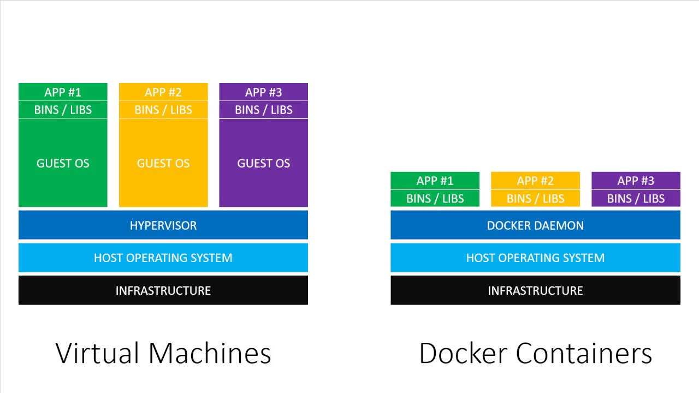

# What are containers

> * Reference: [Official Docker Docs: Overview](https://docs.docker.com/engine/docker-overview/)

## Docker vs VMs



## Docker Architecture


## Exercises

### Preparation - Install Docker

Follow the [official Docker installation](https://docs.docker.com/install/) instructions to get Docker in your laptop.

When you are ready... prepare for Shell scripting! 


#### Useful references:

 * [`docker run` cli usage](https://docs.docker.com/engine/reference/commandline/run/)

### 1.1.1 Run a container

Execute a container that runs **Nginx v1.15**. Search in [Docker Hub](https://hub.docker.com/) for the official Nginx Image.

> **Hint:** take a look at the `docker run` command
>
> Also, to cleanup your containers you can remove all of them with: `docker rm -f $(docker ps -aq)`

<details>
<summary>Solution</summary>

```shell
docker run --name my-nginx-server nginx:1.15
```
</details>


### 1.1.2 Access to your container IP

Try to find the IP address of your container and access to its on port 80

> **Hint:** the `docker inspect` command might help you... ;)

<details>
<summary>Solution</summary>

```
docker inspect my-nginx-server | jq ".[0].NetworkSettings.IPAddress"
```
</details>

### 1.1.3 Expose Nginx ports in your laptop

Now, we'll forward our `:80` port in the laptop to the same port in the container. 

<details>
<summary>Solution</summary>

```
docker run --name my-nginx-server -p 80:80 nginx:1.15
```
</details>


### 1.1.4 Make Nginx to serve your HTML resources


Mount the contents of `resources/html` into the Nginx container. Take a look at the [official Nginx Docker Image documentation](https://hub.docker.com/r/library/nginx/) to find the destination folder.

> **Hint:** look at the `--volume` option of the `docker run` command

<details>
<summary>Solution</summary>

```
docker run --name my-nginx-server -p 80:80 -v $PWD/resources/html:/usr/share/nginx/html:ro nginx:1.15
```
</details>


### 1.1.5 Something more complicated... Container Networks!


Let's run a couple or three containers, and connect them in a network. Let's install Wordpress connected to a MySql database, both running in Docker containers.

First step will be creating a Docker network:

```
docker network create wordpress
```

Then, we create a container using the official [MySql Docker image](https://hub.docker.com/_/mysql). To attach the container to the network previously create we use the `--network` option in the `docker run` command.

> **Hint:** you can customize the MySql config using environments variables, by adding this to the docker run command: `-e MYSQL_ROOT_PASSWORD=somewordpress -e MYSQL_DATABASE=wordpress -e MYSQL_USER=wordpress -e MYSQL_PASSWORD=wordpress`

<details>
<summary>Solution: MySql container</summary>

```
docker run -d --name wp-database \
  -e MYSQL_ROOT_PASSWORD=somewordpress \
  -e MYSQL_DATABASE=wordpress \
  -e MYSQL_USER=wordpress \
  -e MYSQL_PASSWORD=wordpress \
  --network wordpress \
  mysql:5.7
```
</details>

Then we are ready to create the container with [Wordpress](https://hub.docker.com/_/wordpress) As we did with MySql, you can set some configuration with environment variables: `-e WORDPRESS_DB_HOST=wp-database:3306 -e WORDPRESS_DB_USER=wordpress -e WORDPRESS_DB_PASSWORD=wordpress`.

<details>
<summary>Solution: Wordpress container</summary>

```
docker run -d --name wp-wordpress \
  -e WORDPRESS_DB_HOST=wp-database:3306 \
  -e WORDPRESS_DB_USER=wordpress \
  -e WORDPRESS_DB_PASSWORD=wordpress \
  -p 8000:80 \
  --network wordpress \
  wordpress:latest
```

</details>

<details>
<summary>Solution: all together</summary>

```
docker network create wordpress
docker run -d --name wp-database \
  -e MYSQL_ROOT_PASSWORD=somewordpress \
  -e MYSQL_DATABASE=wordpress \
  -e MYSQL_USER=wordpress \
  -e MYSQL_PASSWORD=wordpress \
  --network wordpress \
  mysql:5.7

docker run -d --name wp-wordpress \
  -e WORDPRESS_DB_HOST=wp-database:3306 \
  -e WORDPRESS_DB_USER=wordpress \
  -e WORDPRESS_DB_PASSWORD=wordpress \
  -p 8000:80 \
  --network wordpress \
  wordpress:latest
```

</details>
